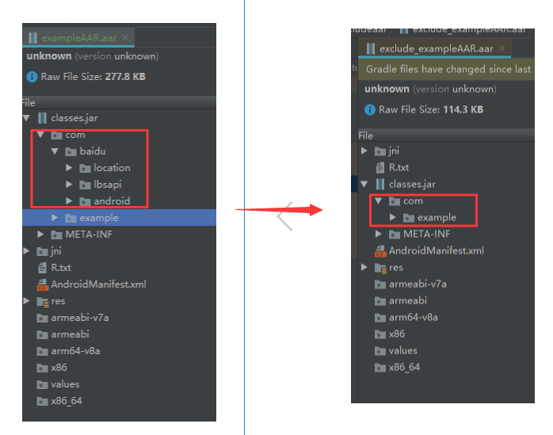
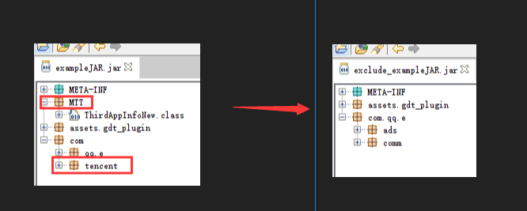
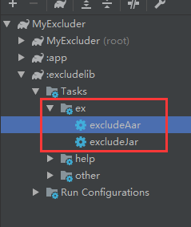

# 排除AAR(Jar)包中冗余或者冲突类的gradle脚本
Forked From  https://github.com/Siy-Wu/ExcludeAar   
修改部分:1. 增加了so库删除   2.添加了正则,方便添加冲突的类

关于第二点正则:可以直接copy AndroidStudio的冲突日志到AndroidStudio文件中  然后点开正则替换 
就像这样  

引入aar的冲突无所不在，通过远程依赖maven的包可以通过`exclude`关键字搭配`module`和`group`去除某个组，没办法去除具体的类。

那么如果是单独的aar包，想要排除aar下classes.jar包里的某个单独的包或者类怎么办？

需要接入的jar包已经带了腾讯X5核心，当前依赖的已经包含X5核心，冲突又该如何解决呢？

当前的gradle脚本可以解决。


- **目录**
  - [ 1 效果展示
](#1-效果展示)
  - [ 2 如何使用
](#2-如何使用)
  - [ 3 如何实现的
](#3-如何实现的)
    - [ 解压AAR/JAR包
](#解压aarjar包)
    - [ 按照排除规则对解压的jar重新打包(这个是重点)
](#按照排除规则对解压的jar重新打包这个是重点)
    - [ 重新打包成AAR包
](#重新打包成aar包)


## 1 效果展示
如excludelib/libs/exampleAAR.aar，左边是未去除的包结构，右边是去除`com.baidu`之后的：



如excludelib/libs/exampleJAR.jar：



## 2 如何使用
（1）将需要排除的aar或者jar包放在excludelib/libs下。

（2）更改excludelib/build.gradle
```groovy
//需要排除的aar或者jar。（替换成需要排除的）
artifacts.add("exclude", file('libs/exampleAAR.aar'))
artifacts.add("exclude", file('libs/exampleJAR.jar'))
```
（3）设置排除规则 如果您需要排除aar，那么请更改excludelib/excludeAar.gradle；如果您需要排除jar，那么请更改excludelib/excludeJar.gradle
```groovy
//需要排除的包名
def excludePackages = ['com.baidu']
//需要排除的类(需要全类名)
def excludeClasses = []
```
（4）运行排除任务



排除后生成的aar在excludelib/build/excludeaar下，排除后生成的jar位于excludelib/build/excludejar。

然后就可以愉快的使用啦~
## 3 如何实现的
**aar排除步骤：**

1、获取到需要排除的原始AAR包

2、解压AAR包（zipTree配合Task Copy）

3、解压AAR包中的class.jar（zipTree配合Task Copy）

4、按照排除规则对解压的class.jar重新打包(Task Jar)

5、重新打包成AAR包(Task Zip)

**jar排除步骤**

1、获取到需要排除的原始jar包

2、解压jar包（zipTree配合Task Copy）

3、按照排除规则对解压的jar重新打包(Task Jar)

### 解压AAR/JAR包
```Groovy
task unZipAar(type: Copy) {
    def zipFile = getDefaultAar()
    def outputDir = unZipAarFile
    from zipTree(zipFile)
    into outputDir
}
```
主要原理：zipTree配合Copy，实现解压。

Copy Task官方讲解：https://docs.gradle.org/current/dsl/org.gradle.api.tasks.Copy.html

ziptree源码主要解析：创建一个新的file tree包含原来zip的内容，可以配合Copy实现解压。
```java
public interface Project{
    /**
    * <p>Creates a new {@code FileTree} which contains the contents of the given ZIP file.
     * You can combine this method with the {@link #copy(groovy.lang.Closure)}
     * method to unzip a ZIP file
     * @param zipPath The ZIP file. Evaluated as per {@link #file(Object)}.
     * @return the file tree. Never returns null.
     */
    FileTree zipTree(Object zipPath);
}
```

### 按照排除规则对解压的jar重新打包(这个是重点)
```Groovy
task zipJar(type: Jar) {
    baseName = 'classes'
    from unZipJarFile
    destinationDir unZipAarFile
    exclude getExcludePackageRegex(excludePackages)
    exclude getExcludeClassRegex(excludeClasses)
}
```
这个步骤就是把之前解压的classes.jar文件，按照排除规则用Task Jar重新打包成jar文件。

Task Jar官方讲解：https://docs.gradle.org/current/dsl/org.gradle.jvm.tasks.Jar.html

|Property/Method	|Description|
|:----------|:------------|
|baseName|压缩后的jar文件名。|
|from(sourcePaths)    |需要压缩的目录。|
|destinationDir|压缩后存放的目录。|
|exclude(excludes)       |需要排除的文件。|

### 重新打包成AAR包
```Groovy
task excludeAar(type: Zip) {
    group 'ex'
    description '生成一个排除之后的aar包'
    baseName excludeAarName
    extension "aar"
    from unZipAarFile
    destinationDir excludeAarFile
}
```
对classes.jar处理完成的aar重打包，主要用到Task Zip。

Task Zip官方讲解：https://docs.gradle.org/current/dsl/org.gradle.api.tasks.bundling.Zip.html

|Property/Method	|Description|
|:----------|:------------|
|group|setGroup(String group) 将当前的Task设置到指定组。|
|description|setDescription(@Nullable String description) Task描述。|
|baseName|压缩后的aar文件名。|
|extension|压缩后的文件扩展名。|
|from(sourcePaths)    |需要压缩的目录。|
|destinationDir|压缩后存放的目录。|

*当前项目fork于https://github.com/Siy-Wu/ExcludeAar，非常感谢Siy-Wu。*

